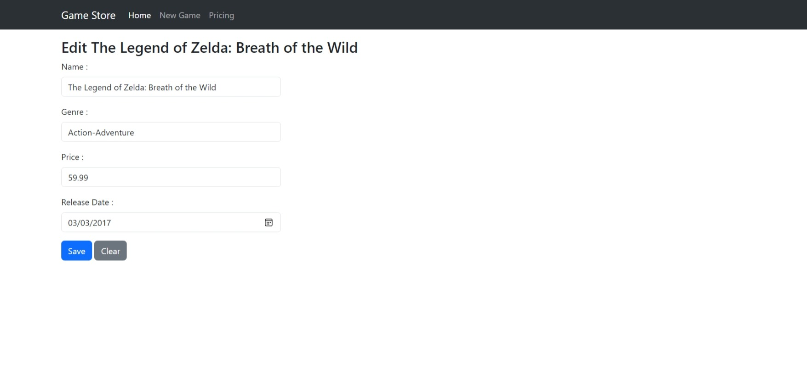
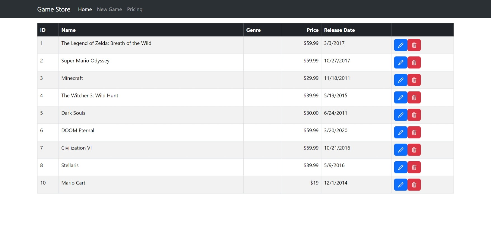

# BlazorGameStore
A basic example Blazor project

Backend API is included.

To Start the project -

cd into the API project and run the API using
dotnet run

Run the Blazor App through VS code/Studio or use dotnet run command

Home Page

Edit Game Page

